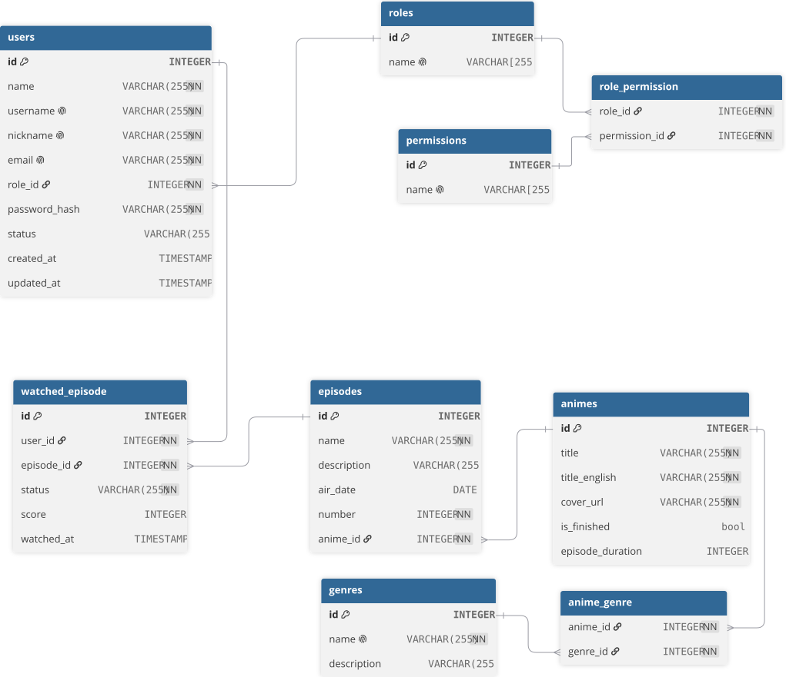

# Myani

**Seus animes, seu progresso, tudo em um só lugar.**

---

O Myani é um espaço para organizar seus animes: registre o episódio em que parou, acompanhe o progresso de cada um e mantenha reunido tudo o que já assistiu, está assistindo ou ainda pretende assistir.

## Sobre o projeto

O Myani nasceu de uma necessidade pessoal. Eu usava o TV Time para acompanhar o que assistia e, com o encerramento da plataforma, decidi construir minha própria ferramenta em vez de migrar tudo para outro serviço. A ideia acabou se tornando o projeto da disciplina de **Programação Web Back-End** da **UTFPR**, ministrada pelo professor **Willian Massami Watanabe**.

Até aqui, meus estudos e experiências com back-end foram em Java, Kotlin e Spring Boot. Com o Myani, a proposta é levar esse conhecimento para um novo ecossistema: Python e Flask, tecnologias novas para mim e pelas quais tenho interesse.

## Funcionalidades

- Busca de animes
- Página com as informações de cada anime
- Lista pessoal de animes
- Registro do episódio atual
- Acompanhamento do progresso
- Organização por status
- Histórico de animes assistidos

## Modelagem do banco de dados

